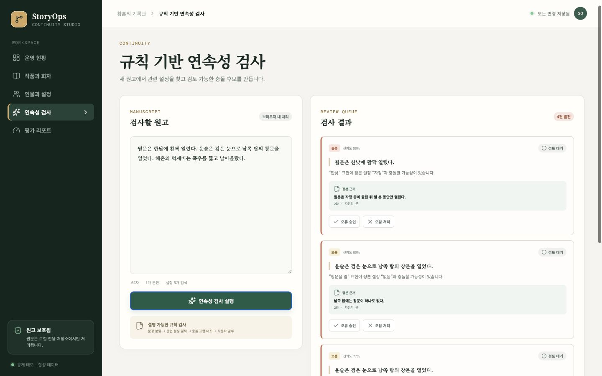

# StoryOps

> 장편 서사의 초안·정본·인물·설정·연속성 검수를 한곳에서 관리하는 로컬 우선 콘텐츠 운영 도구

[](https://github.com/internalforces/StoryOps/actions/workflows/ci.yml)
[](https://github.com/internalforces/StoryOps/actions/workflows/deploy-pages.yml)

[라이브 데모](https://internalforces.github.io/StoryOps/) · [시연 가이드](docs/DEMO.md) · [아키텍처](docs/ARCHITECTURE.md) · [문제 해결 사례](docs/CASE-STUDY.md) · [평가 보고서](docs/EVALUATION.md)



## 왜 StoryOps인가

장편 콘텐츠는 회차가 늘어날수록 정본 설정의 위치, 초안과 완성본의 상태, 오류 판단의 근거를 추적하기 어려워집니다. StoryOps는 이 문제를 **구조화된 콘텐츠 관리 → 관련 설정 검색 → 충돌 후보 제시 → 사람의 최종 판정** 흐름으로 다룹니다.

공개 데모에는 합성 데이터만 포함됩니다. 실제 원고와 파생 데이터는 로컬의 `private/` 영역에 격리되며 Git에 추가되지 않습니다.

## 핵심 흐름

1. 작품, 회차, 인물, 설정을 구조화해 관리합니다.
2. 원고 문장을 분할하고 관련 정본 설정을 검색합니다.
3. 충돌 후보와 신뢰도, 근거 회차를 함께 제시합니다.
4. 사용자가 오류 또는 오탐으로 판정하고 결과를 브라우저에 저장합니다.

## 구현 범위

| 영역 | 제공 기능 |
|---|---|
| 콘텐츠 운영 | 작품·회차·인물·설정 CRUD, 초안/정본 상태, 공개 범위 |
| 설정 추적 | 설정과 근거 정본 회차 연결, 관련 설정 검색 |
| 연속성 검수 | 구조화된 충돌 후보, 신뢰도, 근거 회차, 승인·오탐 처리 |
| 평가 | 합성 회귀셋 통과 건수·재현율·Hit@5·MRR·속도·비용 측정 |
| 데이터 경계 | 원본 백업, 회차 분할, 안정 ID, 공개/비공개 파이프라인 |
| 품질·배포 | Vitest 회귀 테스트, GitHub Actions, GitHub Pages |

## 빠른 시작

필수 환경은 Node.js 22 이상입니다.

```bash
git clone https://github.com/internalforces/StoryOps.git
cd StoryOps
npm ci
npm run dev
```

테스트와 운영 빌드:

```bash
npm test
npm run build
```

## 비공개 원고 가져오기

실제 원고는 저장소에 포함되지 않습니다. 저장소의 상위 폴더에 `웹소설/`, `등장인물/`이 있을 때 다음 명령으로 로컬 전용 데이터를 생성합니다.

```bash
npm run import:private -- ..
```

가져오기는 완성본과 초안을 회차별로 분할하고 `private/data/manifest.private.json`을 생성합니다. 개발 서버를 실행한 뒤 운영 현황의 **비공개 매니페스트 불러오기**에서 이 파일을 선택하면 실제 회차 메타데이터가 대시보드에 연결됩니다.

파일은 브라우저에서만 읽으며 서버로 전송하지 않습니다. 대시보드에는 작품·회차·상태만 저장하고 원문, 원본 파일명, 해시, 로컬 경로는 버립니다. `private/`는 Git에서 제외됩니다. 공개 전에는 [데이터 관리 원칙](docs/DATA-GOVERNANCE.md)의 점검 절차를 확인하세요.

## 기술 구성

- React + TypeScript + Vite
- 설명 가능한 한글 토큰/2-gram 검색과 규칙 기반 충돌 후보 생성
- 로컬 파일 선택 기반 비공개 매니페스트 연결
- `localStorage` 기반 데모 CRUD 및 검수 상태 저장
- Vitest 회귀 테스트
- GitHub Actions + GitHub Pages

현재 공개 데모는 API 키와 서버 비용 없이 브라우저에서 동작하는 결정론적 기준선입니다. 프로덕션 확장안은 [아키텍처 문서](docs/ARCHITECTURE.md)에 정리했습니다.

## 프로젝트 구조

```text
src/                    React 애플리케이션과 연속성 검사 로직
scripts/                로컬 원고 가져오기 도구
public/data/            원문이 없는 공개 집계 데이터
docs/                   아키텍처, 평가, 데이터 관리, 시연 자료
.github/workflows/      테스트와 GitHub Pages 배포 자동화
private/                비공개 원고와 파생 데이터(항상 Git 제외)
```

## 문서

| 문서 | 내용 |
|---|---|
| [아키텍처](docs/ARCHITECTURE.md) | 데이터 경계, 처리 흐름, 프로덕션 확장 지점 |
| [문제 해결 사례](docs/CASE-STUDY.md) | 120회 장편 원고를 안전하게 구조화한 과정과 결과 |
| [평가 보고서](docs/EVALUATION.md) | 회귀셋, 검색·분류 지표, 알려진 실패 유형 |
| [데이터 관리 원칙](docs/DATA-GOVERNANCE.md) | 비공개 데이터 위치, 안정 ID, 공개 전 점검 |
| [시연 가이드](docs/DEMO.md) | 1~2분 데모의 장면 구성과 재생성 방법 |

## 참여와 보안

개선 제안과 버그 제보는 [Issues](https://github.com/internalforces/StoryOps/issues)를 이용해 주세요. 코드 기여 전에는 [기여 가이드](CONTRIBUTING.md)를, 민감한 취약점 제보 전에는 [보안 정책](SECURITY.md)을 확인해 주세요.

## 라이선스

현재 이 저장소에는 오픈 소스 라이선스가 지정되어 있지 않습니다. 코드는 공개 열람할 수 있지만, 별도의 허가 없이 복제·배포·상업적 이용 권한이 부여되지는 않습니다.
